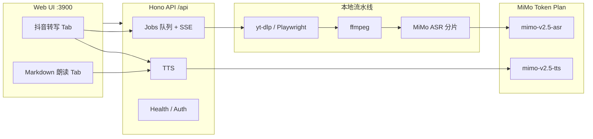

# yk-douyin-asr

> 本地 Web 工具：粘贴抖音分享链接 → 下载视频 → MiMo ASR 转写文案；支持 Markdown 御姐 TTS 朗读。

[](https://nodejs.org/)
[](https://www.typescriptlang.org/)
[](LICENSE)

全栈 **TypeScript**（Hono + Vite），在浏览器里完成转写与朗读。依赖 [小米 MiMo Token Plan](https://mimo.mi.com/docs/zh-CN/price/token-plan) 的 ASR / TTS 能力。

---

## Table of Contents

- [Features](#features)
- [Architecture](#architecture)
- [Prerequisites](#prerequisites)
- [Quick Start](#quick-start)
- [Configuration](#configuration)
- [Usage](#usage)
- [Douyin Login](#douyin-login)
- [API Reference](#api-reference)
- [Project Structure](#project-structure)
- [Development](#development)
- [Troubleshooting](#troubleshooting)
- [Privacy](#privacy)
- [Limitations](#limitations)
- [Roadmap](#roadmap)
- [Contributing](#contributing)
- [License](#license)
- [Acknowledgments](#acknowledgments)

---

## Features

### 抖音转写

- 粘贴分享链接 / 口令，一键转写为纯文本
- **默认只读借用 Chrome 抖音登录态**（无需在工具内重复扫码）
- `yt-dlp` 下载 → `ffmpeg` 抽音频 → **MiMo ASR**（`mimo-v2.5-asr`）
- 长音频按 **时长 + 体积** 自动分片，降低 ASR 输出截断风险
- `Playwright` fallback：yt-dlp 失败时 headless 抓流；可选内置扫码登录
- 实时 **运行日志**（SSE + 轮询兜底）、五步进度条
- 结果支持 **复制**、下载 **Markdown**

### Markdown 朗读

- 独立 Tab：粘贴任意 Markdown / 纯文本
- **MiMo TTS**（`mimo-v2.5-tts`）预置音色 **冰糖** + 御姐风格指令
- 可选去掉 Markdown 符号后再朗读
- 在线播放 + 下载 `.wav`

---

## Architecture



| 层 | 技术 |
|----|------|
| 后端 | Node 20+ · TypeScript · Hono |
| 前端 | Vite · TypeScript |
| 下载 | yt-dlp（Chrome Cookie）· Playwright fallback |
| 媒体 | ffmpeg · ffprobe |
| 语音 AI | OpenAI 兼容 SDK → MiMo Token Plan |

**开发模式**：Vite 在 `3900` 端口对外服务，通过插件内嵌 Hono API（`/api/*`），无需单独开 API 端口。

---

## Prerequisites

| 依赖 | 用途 | 安装 |
|------|------|------|
| **Node.js** ≥ 20 | 运行时 | [nodejs.org](https://nodejs.org/) |
| **ffmpeg** | 抽音频 / 分片 / 合并 | `brew install ffmpeg` |
| **yt-dlp** | 抖音视频下载 | `brew install yt-dlp` |
| **Google Chrome** | 抖音登录态（推荐） | 已登录 [douyin.com](https://www.douyin.com) |
| **MiMo Token Plan Key** | ASR + TTS | [Token Plan 控制台](https://mimo.mi.com/) `tp-xxxxx` |

`npm run dev` 会通过 `scripts/ensure-deps.sh` 自动检查并尝试安装上述依赖（含 Playwright Chromium）。

---

## Quick Start

```bash
git clone <your-repo-url> yk-douyin-asr
cd yk-douyin-asr

npm install

# 创建环境变量（仓库内为 `.env copy.example`，复制为 `.env`）
cp ".env copy.example" .env
# 编辑 .env，填入 MIMO_API_KEY=tp-xxxxx

./scripts/dev.sh
# 或: npm run dev
```

打开 **[http://localhost:3900](http://localhost:3900)**

1. 确认顶栏显示 **✓ Chrome 登录态**（或切换内置扫码）
2. **抖音转写** Tab → 粘贴链接 → **开始转写**
3. 或 **Markdown 朗读** Tab → 粘贴文本 → **御姐朗读**

---

## Configuration

在项目根目录创建 `.env`：

```bash
# 必填 — MiMo Token Plan
MIMO_API_KEY=tp-xxxxxxxxxxxxxxxx
MIMO_BASE_URL=https://token-plan-cn.xiaomimimo.com/v1

# ASR
MIMO_ASR_MODEL=mimo-v2.5-asr
ASR_LANGUAGE=zh
ASR_CHUNK_SEC=90           # 单段 ASR 最长秒数（默认 90，口播密集可再调小）
ASR_MIN_CHARS_PER_SEC=2.5  # 低于此字/秒自动拆半重试

# TTS（Markdown 朗读 / 转写后朗读）
MIMO_TTS_MODEL=mimo-v2.5-tts
MIMO_TTS_VOICE=冰糖
MIMO_TTS_STYLE_PROMPT=成熟御姐女声，中低音，磁性慵懒。请严格逐字朗读…

# 抖音登录
DOUYIN_AUTH_SOURCE=auto     # auto | chrome | playwright | file | none
DOUYIN_CHROME_PROFILE=Default

# 路径
TEMP_DIR=/tmp/yk-douyin-asr
DATA_DIR=~/.yk-douyin-asr

# 服务
HOST=127.0.0.1
PORT=3900
```

### 环境变量说明

| 变量 | 默认值 | 说明 |
|------|--------|------|
| `MIMO_API_KEY` | — | **必填**。Token Plan Key（`tp-` 前缀） |
| `MIMO_BASE_URL` | `https://token-plan-cn.xiaomimimo.com/v1` | MiMo API 基址 |
| `MIMO_ASR_MODEL` | `mimo-v2.5-asr` | 语音识别模型 |
| `ASR_LANGUAGE` | `zh` | `auto` / `zh` / `en` |
| `ASR_CHUNK_SEC` | `90` | 超过此时长自动分片送 ASR |
| `ASR_MIN_CHARS_PER_SEC` | `2.5` | 识别偏短时拆半重试阈值（字/秒） |
| `MIMO_TTS_MODEL` | `mimo-v2.5-tts` | TTS 模型 |
| `MIMO_TTS_VOICE` | `冰糖` | 预置音色（还有 `茉莉` 等） |
| `MIMO_TTS_STYLE_PROMPT` | 御姐 + 逐字朗读 | TTS 风格指令 |
| `DOUYIN_AUTH_SOURCE` | `auto` | 登录态来源策略 |
| `DOUYIN_CHROME_PROFILE` | `Default` | Chrome Profile 名 |
| `TEMP_DIR` | `/tmp/yk-douyin-asr` | 任务临时文件 |
| `DATA_DIR` | `~/.yk-douyin-asr` | Playwright profile、cookies |
| `PORT` | `3900` | Web + API 端口（生产 `npm start`） |

> **注意**：勿将 `.env` 提交到 Git。`MIMO_API_KEY` 仅在 Token Plan 订阅有效期内可用。

---

## Usage

### Tab 1 — 抖音转写

1. 在 Chrome 登录抖音（推荐）
2. 复制分享链接，例如 `https://v.douyin.com/xxxxx/` 或完整分享口令
3. 粘贴到输入框 → **开始转写**
4. 在 **运行日志** 查看下载 / ffmpeg / ASR 每一步
5. 完成后复制文案或下载 `.md`，可点 **御姐朗读**

### Tab 2 — Markdown 朗读

1. 切换到 **Markdown 朗读**
2. 粘贴任意 Markdown 或纯文本（含转写导出的 `.md`）
3. 勾选「去掉 Markdown 符号」（推荐）
4. **御姐朗读** → 底部播放器试听或下载 `.wav`

### 生产部署

```bash
npm run build
npm start
# → http://127.0.0.1:3900
```

---

## Douyin Login

### 方式 A — Chrome Cookie（推荐）

1. 在 **Chrome** 打开 [douyin.com](https://www.douyin.com) 并登录
2. 启动本工具，顶栏应显示 **✓ Chrome 登录态**
3. 工具 **只读** Cookie，不会登出 Chrome

**macOS**：若无法读取 Cookie，请在 **系统设置 → 隐私与安全性 → 完全磁盘访问权限** 中授权 Terminal / Cursor。

### 方式 B — 内置扫码（fallback）

- 使用独立 Playwright Profile：`~/.yk-douyin-asr/chromium-profile/`
- Web UI 内发起扫码，**通常不影响 Chrome**
- 「断开内置会话」仅清除内置数据

### 方式 C — Cookie 文件

`DOUYIN_AUTH_SOURCE=file`，配合 `DATA_DIR/cookies.txt`（Netscape 格式）。

---

## API Reference

Base URL：`http://localhost:3900/api`

### Health

```http
GET /api/health
```

返回 `ffmpeg` / `yt-dlp` / MiMo / 登录态检查结果。

### Auth

| Method | Path | 说明 |
|--------|------|------|
| `GET` | `/api/auth/douyin/status` | 当前登录来源与状态 |
| `GET` | `/api/auth/douyin/browsers` | 可探测的 Chrome Profile |
| `PUT` | `/api/auth/douyin/source` | 切换来源 `{ "source": "chrome" }` |
| `POST` | `/api/auth/douyin/login/start` | 启动内置扫码 |
| `GET` | `/api/auth/douyin/login/:id/events` | 扫码 SSE |
| `POST` | `/api/auth/douyin/logout` | 清除内置会话 |

### Jobs（转写）

```http
POST /api/jobs
Content-Type: application/json

{ "url": "https://v.douyin.com/xxxxx/" }
```

```http
GET /api/jobs/:id
GET /api/jobs/:id/events    # SSE：event=update | log
```

**Job 阶段**：`queued` → `parsing` → `downloading` → `extracting` → `transcribing` → `done` | `failed`

### TTS（朗读）

```http
GET /api/tts              # 健康检查
POST /api/tts
Content-Type: application/json

{ "text": "要朗读的正文" }
```

响应：`{ "format": "wav", "audio_base64": "...", "chunks": 3 }`

---

## Project Structure

```
yk-douyin-asr/
├── server/                 # Hono API（TypeScript）
│   └── src/
│       ├── app.ts          # 路由挂载
│       ├── jobs.ts         # 任务队列 + SSE
│       ├── pipeline/       # douyin · audio · mimo-asr · mimo-tts
│       └── routes/         # health · auth · jobs · tts
├── web/                    # Vite 前端
│   ├── src/
│   │   ├── main.ts         # 双 Tab UI
│   │   ├── transcribe.ts   # 任务 / SSE / 轮询
│   │   ├── tts.ts          # 朗读客户端
│   │   └── log-panel.ts    # 运行日志面板
│   └── plugins/hono-api.ts # 开发态内嵌 API
├── scripts/
│   ├── dev.sh              # 推荐启动脚本
│   └── ensure-deps.sh      # 依赖自检 / 安装
├── docs/PLAN.md            # 设计文档
├── AGENTS.md               # AI / 协作约定
└── package.json            # npm workspaces
```

---

## Development

```bash
npm install
npm run ensure-deps    # 仅检查依赖
npm run dev            # :3900，predev 自动 ensure-deps
npm run typecheck      # server + web
npm run build          # 构建生产产物
npm start              # 生产服务
```

### npm scripts

| Script | 说明 |
|--------|------|
| `dev` | 开发服务器（Vite + 内嵌 Hono） |
| `build` | 编译 server + web |
| `start` | 生产单进程服务 |
| `typecheck` | TypeScript 检查 |
| `ensure-deps` | ffmpeg / yt-dlp / Playwright 等 |

### Worktree（可选）

```bash
REPO=$(basename "$(git rev-parse --show-toplevel)")
# ../${REPO}-worktrees/<topic>
# 分支: yk-douyin-asr/<topic>
```

详见 [`AGENTS.md`](AGENTS.md)。

---

## Troubleshooting

| 现象 | 可能原因 | 处理 |
|------|----------|------|
| 顶栏「未检测到登录态」 | yt-dlp 未装 / 无 Cookie 权限 | `brew install yt-dlp`；macOS 完全磁盘访问 |
| API 404 / 401 | 端口被占 / 访问错端口 | 只用 **3900**；`lsof -i :3900` |
| TTS 404 | 开发态 Hono 缓存旧路由 | 重启 `./scripts/dev.sh` |
| 转写不全 | ASR 单段过长或某段识别偏短 | 默认已 90s 分片 + 偏短拆半重试；仍不全可设 `ASR_CHUNK_SEC=60`；看日志「识别偏短」「拆半重试」 |
| 画面文字没转写 | ASR 只识别**口播/旁白**，不含视频内字幕/花字 | 需 OCR 或手动复制；本工具不做画面文字识别 |
| 日志停在「识别」 | UI 未收到完成事件 | 硬刷新；看是否有「任务完成」日志 |
| `下载时长偏短` | 视频未下完整 | 升级 yt-dlp：`brew upgrade yt-dlp` |
| Playwright 兜底 | yt-dlp 失败 | 日志会 WARN；尽量保证 yt-dlp 可用 |

### 检查服务状态

```bash
curl -s http://127.0.0.1:3900/api/health | jq .
curl -s http://127.0.0.1:3900/api/tts | jq .
```

---

## Privacy

- 视频在 **本机** 下载，经 ffmpeg 提取音频
- **音频会上传至小米 MiMo 云端** 做 ASR；TTS 文本同样发往 MiMo
- 临时文件在任务结束后删除（`TEMP_DIR/<job_id>/`）
- 内置登录数据存于 `~/.yk-douyin-asr/`
- **请勿处理敏感内容**，除非接受云端处理

---

## Limitations

- 内存 Job 队列，**重启后任务丢失**
- 仅支持 Douyin 分享链接，非通用爬虫
- MiMo ASR 单次输出约 **2k tokens**，长视频依赖分片合并
- Token Plan Key 有订阅有效期与用量限制；TTS 预置模型限时免费政策以官方为准
- Playwright fallback 可能只抓到预览流，转写质量不如 yt-dlp

---

## Roadmap

- [ ] TTS / 转写结果本地缓存（同文本不重复合成）
- [ ] UI 音色下拉（冰糖 / 茉莉）
- [ ] 任务持久化（SQLite）
- [ ] 导出 SRT / 时间轴（若 ASR 支持）

---

## Contributing

1. Fork / 建分支 `yk-douyin-asr/<topic>`
2. `npm run typecheck` 通过后再提 PR
3. 勿提交 `.env` 或 `~/.yk-douyin-asr/` 用户数据
4. 协作约定见 [`AGENTS.md`](AGENTS.md)

---

## License

This project is licensed under the [MIT License](LICENSE).

---

## Acknowledgments

- [yt-dlp](https://github.com/yt-dlp/yt-dlp) — 视频下载
- [ffmpeg](https://ffmpeg.org/) — 音视频处理
- [Hono](https://hono.dev/) — 轻量 Web 框架
- [Xiaomi MiMo](https://mimo.mi.com/) — ASR / TTS API
- [Playwright](https://playwright.dev/) — 浏览器 fallback

---

<p align="center">
  <sub>Built for local Douyin → text workflows · Not affiliated with Douyin or Xiaomi</sub>
</p>
